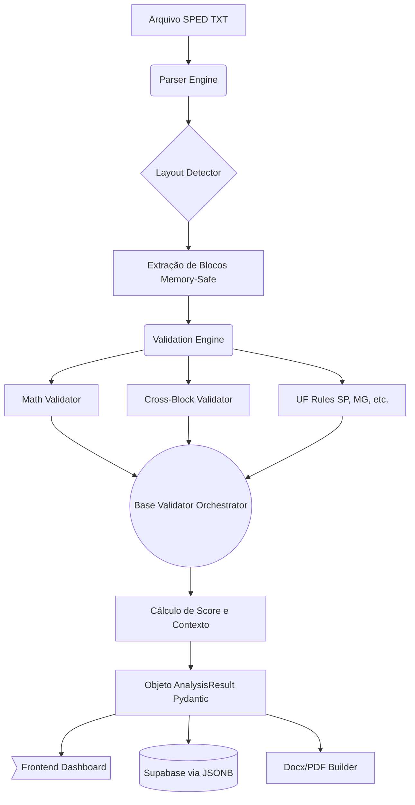

# 🛡️ EFD Compliance

> **Validação Expert e Auditoria Inteligente de Arquivos SPED EFD ICMS/IPI**


---

## 📸 Demonstração


*O Dashboard interativo apresenta o Score de Conformidade, resumos por blocos e filtro de achados gerados pelo motor de auditoria.*

---

## 📖 Sobre o Projeto

O **EFD Compliance** é uma solução de auditoria tributária de alto desempenho desenhada para analisar e validar arquivos do SPED EFD ICMS/IPI (pós-validação pelo PVA oficial). O objetivo é realizar cruzamentos profundos, consistência matemática e validações específicas por estado (UF) em questão de milissegundos. 

A ferramenta fornece não apenas um **Score de Conformidade (0-100%)**, mas constrói automaticamente Dossiês Técnicos e Relatórios Circunstanciados em formatos profissionais (.docx e .pdf) para analistas e contadores.

### ✨ Funcionalidades Chave
- 🧮 **Validações Matemáticas:** Reconstrução de saldos do IPI (E520) e ICMS (E110, E210, G110).
- 🔗 **Cruzamentos Avançados:** Verificação interblocos (Ex: C190 vs E110, E111 vs E110, Obrigatoriedade do E116).
- 📜 **Regras por UF:** Verificações estaduais robustas, como Tabela 5.1.1, DIFAL, CIAP e obrigatoriedade de blocos (K e H).
- 📊 **UI Glassmorfismo & Dashboard:** Interface puramente responsiva em React, sem dependência de UI kits pesados.
- 📑 **Dossiê Automático:** Geração de relatórios com arquitetura de 8 seções padronizadas pelo Antigravity Design System.
- ⏱️ **Arquitetura em Memória:** Processamento do arquivo sequencial ultra rápido.

---

## 🛠 Tech Stack

- **Frontend:** `React 18` + `Vite` + `React Router` + `Vanilla CSS` (Antigravity Design System) - *Performance pura sem frameworks CSS atrelados.*
- **Backend:** `FastAPI` + `Pydantic v2` + `Python 3.12` - *Server modular, tipagem estrita e processamento assíncrono.*
- **Parsing/Engine:** `Custom Generators Pattern` - *Parser desenvolvido do zero para evitar memory bloating em arquivos SPED enormes.*
- **Relatórios:** `python-docx` + `WeasyPrint` (HTML to PDF) - *Qualidade Enterprise de exportação.*
- **Banco de Dados (Histórico):** `Supabase` (PostgreSQL) - *BaaS na nuvem para armazenar o JSONB de resultados.*

---

## 🏗 Arquitetura e Design

O processamento do EFD ocorre através de um *Pipeline Tático*: a rota FastAPI atua como Orchestrator do fluxo, ativando módulos isolados de Parsing e Validação sucessivamente antes de construir o JSONB final.



### 🧠 Decisões Técnicas
1. **Pydantic Model Dump (JSONB em Banco):** Pelo design dinâmico do compliance fiscal, fragmentar os _achados_ em tabelas SQL puras seria ineficiente e burocrático (schema overhead). A escolha de despejar todo o resultado verificado no campo `result_json` usando PostgreSQL JSONB garante inserções instantâneas (milissegundos) e evita dezenas de JOINS.
2. **Factory de Regras Fiscais:** A arquitetura de validação adere firmemente ao **Open/Closed Principle**. Novas UFs (ex: RJ, SC) podem ser adicionadas com uma nova classe que herda de `BaseUF` no diretório `uf_rules`, injetando regras dinâmicamente no parser sem quebrar arquiteturas matemáticas centrais.
3. **Vanilla CSS (Design Tokens):** A interface abandona frameworks pesados a favor de variáveis puras nativas (Glassmorfismo, Gauge Components SVG manuais) entregando excelência em LCP e Cumulative Layout Shift.

---

## 🚀 Como Executar

### Pré-requisitos
- Python 3.12+ 
- Node.js 18+
- Projeto Supabase criado

### 1. Clonando o Repositório e Setup do DB

```bash
git clone https://github.com/jacksonsantosjr/EFD-Compliance.git
cd EFD-Compliance
```

No **Supabase**, crie a tabela base presente na raiz conceitual do projeto:
```sql
CREATE TABLE public.sped_analyses (
    id UUID DEFAULT gen_random_uuid() PRIMARY KEY,
    created_at TIMESTAMP WITH TIME ZONE DEFAULT timezone('utc'::text, now()) NOT NULL,
    filename TEXT NOT NULL,
    file_hash TEXT NOT NULL,
    cnpj TEXT NOT NULL,
    razao_social TEXT,
    uf VARCHAR(2),
    periodo_ini DATE,
    periodo_fin DATE,
    score NUMERIC(5,2) NOT NULL,
    total_registros INTEGER NOT NULL,
    result_json JSONB NOT NULL
);
```

### 2. Backend (FastAPI)

```bash
python -m venv venv

# Ativação via CMD Windows
.\venv\Scripts\activate

pip install -r requirements.txt
```

Crie o arquivo `.env` na raiz do projeto:
```env
API_HOST=0.0.0.0
API_PORT=8000
API_CORS_ORIGINS=http://localhost:5173

# Coloque as credenciais do seu Supabase aqui para o DB Histórico
SUPABASE_URL=https://sua-url-aqui.supabase.co
SUPABASE_KEY=eyJh...

MAX_FILE_SIZE_MB=500
```

Suba a API:
```bash
uvicorn api.main:app --reload --host 0.0.0.0 --port 8000
```

### 3. Frontend (Vite)

Em outro terminal:
```bash
cd frontend
npm install
npm run dev
```
Acesse [http://localhost:5173](http://localhost:5173) no seu navegador.

---

## 🧪 Testes e Qualidade

O EFD Compliance vem instrumentado com testes unitários abrangentes na pasta `tests/` que aferem assertivamente valores precalculados sobre o Parser e Validador em arquivos de fixtures reais. Para executar a bateria completa:

```bash
# Roda a stack de validação de leitura (Engine)
python tests/test_parser.py

# Roda a stack de validação tributária (Regras, Matemática e Orquestração)
python tests/test_validators.py
```

---

## 📂 Estrutura de Pastas

A arquitetura do repositório foi modularizada em diretórios autônomos visando escalabilidade:

```text
efd-compliance/
├── api/                  # Gateway FastAPI e Configurações REST
│   ├── models/           # Schemas Pydantic fortemente tipados
│   └── routes/           # Endpoints Controllers e Serviços de Storage
├── database/             # Clientes de persistência (Supabase)
├── frontend/             # SPA React + Vite + Vanilla Design System
├── knowledge_base/       # Tabelas Estáticas Base (Tabela 5.1.1, NCMs)
├── parser/               # Motor "Core" de parsing (Layouts, Registros)
├── reports/              # Geradores PDF e Builders DOCX via python-docx
├── tests/                # Cobertura de Testes Unitários de Regras
└── validators/           # Motores de Cruzamento Tático e Regras de Negócio
    └── uf_rules/         # Repositório Extensível p/ Lógicas Fiscais por UF
```

---

## 📌 Roadmap e Melhorias

1. **Autenticação e Multi-Tenancy:** Implementar Supabase Auth no Frontend para controle de acesso restrito (JWT RLS Policy).
2. **Gráfico Temporal / Dashboard de Tendências:** Utilizar a funcionalidade base do Comparador para injetar gráficos usando `Recharts` ou equivalente, analisando variações de multas ou score de um CNPJ num espaço temporal e gerenciar flutuações de ICMS ST.
3. **Validação Bloco D:** Integrar completamente os serviços e conhecimentos técnicos remotos ligados ao D190 e conhecimentos de frota (Fase 6).

---

Documentação gerada via **Antigravity AI** - 04/2026
